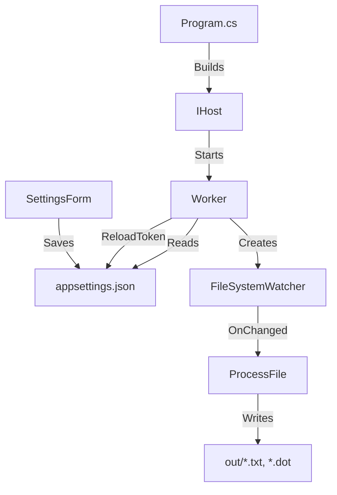

# Автоматический конвертер Protel2 netlists

## NetFileConverter — Сервис автоматической конвертации файлов

NetFileConverter — это легковесное Windows-приложение на базе .NET 8, сочетающее в себе мощь фоновой службы (`BackgroundService`) и удобство графического интерфейса Windows Forms. Приложение работает в системном трее, отслеживает изменения в выбранных папках в реальном времени и автоматически обрабатывает новые файлы.

---

## 🚀 1. Функционал

- **Фоновый мониторинг** – `FileSystemWatcher` отслеживает создание, изменение и переименование файлов в нескольких директориях одновременно.
- **Интеграция в системный трей** – приложение не занимает место на панели задач, полностью управляется через иконку в трее.
- **Динамическая конфигурация** – настройки папок хранятся в `appsettings.json`. Приложение на лету подхватывает изменения без ручного перезапуска.
- **Уведомления Windows** – всплывающие подсказки (balloon tips) информируют об успешной конвертации или ошибках.
- **Полноценный инсталлятор** – автоматическое развертывание, прописывание в автозапуск для всех пользователей и чистое удаление через Панель управления.

### Детали обработки файлов

- **Фильтр по расширению** – обрабатываются только файлы с расширением `.net` (регистронезависимо).
- **Автоопределение кодировки** – исходный файл читается в системной кодировке, результат всегда сохраняется в UTF‑8 без BOM.
- **Упрощение нетлиста** – из секций цепей `( ... )` извлекаются имена цепей и пины (формат `Обозначение-НомерВывода`). Координаты и служебные строки игнорируются.
- **Генерация BOM** – из компонентных блоков `[ ... ]` собираются поля `DESIGNATOR`, `PARTTYPE` и `Comment`, формируя перечень компонентов.
- **Экспорт в Graphviz DOT** – для каждого нетлиста создаётся файл `*_net.dot` с описанием графа «компонент – цепь».
- **Первичное сканирование** – при запуске сервис обрабатывает все уже существующие `.net` файлы в отслеживаемых папках.

---

## 🧱 2. Архитектура

### 2.1. Основные компоненты

| Компонент | Назначение |
|-----------|------------|
| `Program.cs` | Точка входа. Настраивает хост (.NET Generic Host), инициализирует иконку в трее, управляет жизненным циклом приложения. |
| `Worker.cs` | Фоновая служба (`BackgroundService`). Реализует `FileSystemWatcher`, парсинг нетлистов, генерацию выходных файлов. |
| `SettingsForm.cs` | Окно настроек Windows Forms. Позволяет добавлять/удалять папки и сохранять изменения. |
| `appsettings.json` | Конфигурационный файл. Хранит список отслеживаемых директорий. **Примечание:** начиная с версии 1.1, файл хранится в `%APPDATA%\NetFileConverter\`, чтобы избежать проблем с правами доступа при установке в `Program Files`. |

### 2.2. Взаимодействие сервисов



- **DI-контейнер** .NET используется для регистрации `Worker` и `SettingsForm`.
- **`IConfiguration`** автоматически перезагружается при изменении `appsettings.json` благодаря `reloadOnChange: true`. `Worker` подписывается на токен перезагрузки и пересоздаёт наблюдателей.
- **Уведомления в трее** отправляются через статический метод `Program.ShowNotification()`, который вызывается из `Worker`.

### 2.3. Роль Inno Setup в установке

**Inno Setup** — это бесплатный компилятор инсталляторов для Windows. Скрипт `installer.iss` описывает, какие файлы копировать, какие ярлыки создавать и какие действия выполнять до/после установки.

В проекте `installer.iss` выполняет следующие задачи:

- Копирует `NetFileConverter.exe` и сопутствующие файлы в `{pf}\NetFileConverter`.
- **Не копирует** `appsettings.json` (приложение само создаёт его в `AppData` при первом запуске). Благодаря этому настройки пользователя не затираются при обновлении.
- Создаёт общесистемный ярлык в `{commonstartup}` → автозапуск для всех пользователей.
- Создаёт ярлык на общем рабочем столе `{commondesktop}`.
- В секции `[Code]` реализовано принудительное закрытие предыдущего экземпляра приложения через `taskkill` (чтобы можно было перезаписать исполняемый файл).
- Добавляет запись в `AppPaths`, чтобы программу можно было запустить через `Win+R` → `NetFileConverter`.

**Как собрать инсталлятор:**

1. Выполнить публикацию проекта (команда `dotnet publish ...` из раздела 3).
2. Открыть `installer.iss` в **Inno Setup Compiler**.
3. Нажать `Ctrl+F9` (Compile).
4. Готовый `NetFileConverter_Setup.exe` появится в папке `.\installer_output\`.

---

## 📦 3. Требования

- **Windows 10/11** или **Windows Server 2016+**
- **.NET SDK 8.0** (проект совместим с .NET 10)
- **VS Code** (рекомендуется) с расширениями: C# Dev Kit, Error Lens, NuGet Gallery
- **Graphviz** (опционально, для визуализации DOT-файлов) – [скачать](https://graphviz.org/download/)

---

## 💻 4. Работа с приложением

### Запуск и управление в трее

1. После установки программа автоматически запускается и сворачивается в системный трей (около часов).
2. Нажмите правой кнопкой мыши по иконке → контекстное меню:
   - **Настройки** – открывает окно управления отслеживаемыми папками.
   - **Выход** – полностью закрывает приложение и останавливает фоновую службу.
3. Двойной клик по иконке также открывает окно настроек.

### Настройка папок для отслеживания

1. Откройте окно «Настройки».
2. В появившемся окне отображается текущий список сканируемых директорий.
3. Нажмите **«Добавить папку»** и выберите нужный каталог.
4. Чтобы удалить папку из мониторинга, выберите её в списке и нажмите **«Удалить»**.
5. Нажмите **«Сохранить»**. Настройки запишутся в `appsettings.json` (лежащий в `%APPDATA%\NetFileConverter\`), и служба автоматически переинициализирует наблюдателей.

---

## 🛠 5. Разработка и сборка

### Очистка проекта

```bash
dotnet clean
```

### Тестовая сборка (Debug)

```bash
dotnet build
```

### Публикация в один файл (Release)

```bash
dotnet publish -c Release -r win-x64 --self-contained true /p:PublishSingleFile=true /p:PublishReadyToRun=true /p:IncludeNativeLibrariesForSelfExtract=true
```

Результат: `bin\Release\net8.0-windows\win-x64\publish\`

- `NetFileConverter.exe` – приложение (со встроенной иконкой)
- `appsettings.json` – **не используется напрямую** (приложение при первом запуске создаст свою копию в `AppData`)

---

## 📝 6. Changes (История изменений)

### Версия 1.1 (текущая)

- **Исправлена проблема с правами доступа** – конфигурационный файл `appsettings.json` теперь хранится в `%APPDATA%\NetFileConverter\` вместо папки с программой. При первом запуске старый файл (если существовал рядом с `exe`) автоматически переносится в `AppData`.
- **Улучшена настройка хоста** – `HostBuilder` заменён на ручную конфигурацию с указанием базового пути к `AppData`.
- **Изменён `installer.iss`** – файл `appsettings.json` больше не копируется в `Program Files`, что исключает ошибки записи для обычного пользователя.

### Версия 1.0 (исходная)

- Первый релиз с функционалом мониторинга, конвертации в BOM и DOT, трей-иконкой и установщиком на основе Inno Setup.

---

## ⚙️ 7. Примечания для разработчиков

- **Логирование** – все события пишутся в консоль (при запуске из терминала) и через `ILogger`. При работе как обычное приложение логи доступны только через отладчик.
- **Файловая структура выходных данных** – для каждого обработанного `.net` файла в подпапке `out` создаются:
  - `<имя>_orig.txt` – точная копия исходника
  - `<имя>_net.txt` – список цепей с пинами
  - `<имя>_bom.txt` – перечень компонентов
  - `<имя>_net.dot` – граф для Graphviz
- **Глобальный автозапуск** обеспечивается ярлыком в `C:\ProgramData\Microsoft\Windows\Start Menu\Programs\StartUp`. При удалении программы ярлык удаляется автоматически.

---

